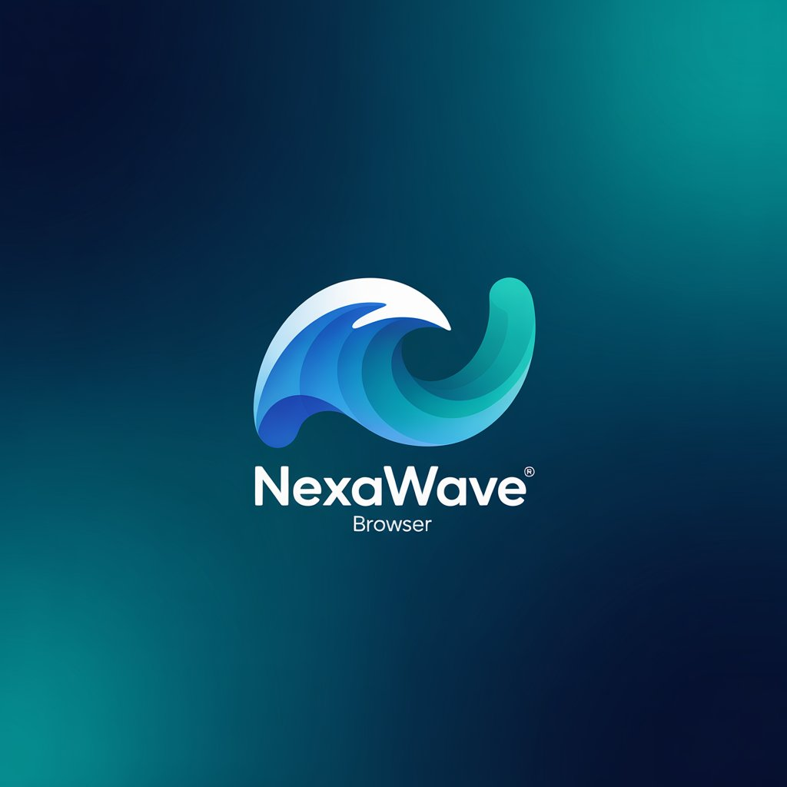

# 🌐 NexaWave Browser

<div align="center">
  
</div>

<div align="center">
  
  
  
</div>

<p align="center">A sleek, modern web browser built with Python and PyQt5. This project demonstrates how to create a feature-rich web browser with a clean, modern UI that's lightweight and customizable.</p>

## ✨ Features

- **🎨 Clean Modern Interface**: Sleek design with modern styling and intuitive controls
- **📑 Tab Management**: Create, close, and navigate between multiple browser tabs
- **🧭 Modern Navigation**: Forward, back, reload, and home navigation buttons
- **🔍 Smart URL Bar**: Intelligent URL handling with search functionality
- **⚡ URL Auto-completion**: Remembers visited URLs for quick access
- **📊 Progress Indication**: Subtle loading progress bar with automatic hiding when complete
- **🖥️ High DPI Support**: Optimized for high-resolution displays
- **🔍 Integrated Search**: Search directly from the URL bar using Google
- **🏠 Home Button**: Quick access to your homepage
- **🔄 Reload**: Refresh the current page
- **📋 Menu Bar**: File and Help menus with keyboard shortcuts
- **ℹ️ About Dialog**: Information about the browser and developer

## 🔧 Requirements

- Python 3.6+
- PyQt5 5.15+
- PyQtWebEngine 5.15+

## 🚀 Installation

1. Clone this repository:
   ```bash
   git clone https://github.com/ilyas-doughmi/NexaWave-Browser.git
   cd NexaWave-Browser
   ```

2. Create and activate a virtual environment (recommended):
   ```bash
   python -m venv venv
   
   # On Windows
   venv\Scripts\activate
   
   # On macOS/Linux
   source venv/bin/activate
   ```

3. Install required packages:
   ```bash
   pip install -r requirements.txt
   ```

## 🖱️ Usage

Run the browser with:

```bash
python browser.py
```

### 🧭 Navigation

- Type a URL in the address bar and press Enter to navigate
- Enter search terms to search using Google
- Use navigation buttons to move back, forward, reload, or go home
- Click the + button to open a new tab
- Use Ctrl+T to open a new tab
- Use Ctrl+W to close the current tab
- Use Ctrl+Q to exit the browser

## ⚙️ Customization

The browser is designed to be easily customizable:

### 🏠 Changing the Home Page

Modify the default home page by changing the URL in the `go_home()` method:

```python
def go_home(self):
    self.current_browser().setUrl(QUrl("https://ilyas-doughmi.vercel.app/"))
```

### 🎨 Styling

The browser uses QSS (Qt Style Sheets) for styling. You can customize the appearance by modifying the style definitions in each component class.

## 📁 Project Structure

- `browser.py` - Main application file containing all browser functionality
- `requirements.txt` - Required Python packages
- `LICENSE` - MIT license file
- `README.md` - This documentation file
- `nexawave_logo.png` - Browser logo image

## 🛠️ How it Works

NexaWave Browser is built on PyQt5 and uses QWebEngineView for rendering web content. Key components include:

- **UrlBar**: Custom URL input with modern styling
- **TabBar**: Enhanced tab widget for managing multiple pages
- **NavigationToolBar**: Contains browser controls
- **ModernProgressBar**: Visual loading indicator
- **Browser**: Main window that integrates all components

## 📝 License

This project is licensed under the MIT License - see the [LICENSE](LICENSE) file for details.

## 👨‍💻 Developer

Developed with ❤️ by **[ILYAS DOUGHMI](https://ilyas-doughmi.vercel.app/)**

## 🙏 Acknowledgments

- [PyQt5](https://www.riverbankcomputing.com/software/pyqt/) for the UI framework
- [Qt WebEngine](https://doc.qt.io/qt-5/qtwebengine-index.html) for web rendering capabilities
- Icons based on Material Design guidelines 